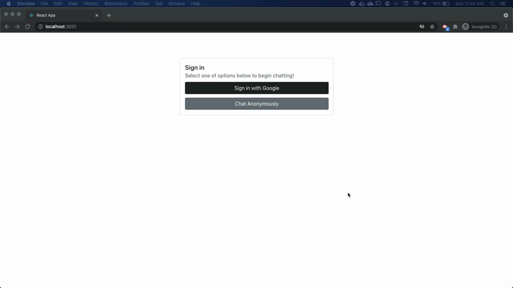

# GraphQL Chatroom
This project was created to practice GraphQL. Previous comments were fetched using queries and comments were added/deleted using mutations. Firebase was used to authenticate the user. 

## Demo

